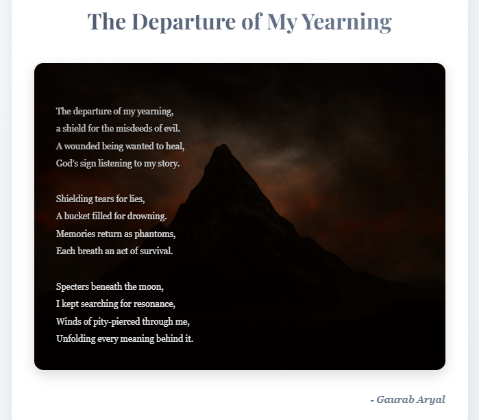

# Poetry Collection Website

A beautiful, responsive poetry website showcasing personal poems with elegant design and smooth animations. Built with modern CSS techniques including glassmorphism effects, parallax backgrounds, and interactive elements.

Project Link: [https://gaurab-arl.github.io/example-poem-site/](https://gaurab-arl.github.io/example-poem-site/)
---

## 📸 Screenshots

### Homepage

*Elegant parallax header with poetry collection introduction*


*Responsive card grid with category filtering*

### Individual Poem Page

*Beautiful poem display with background imagery*

### Loading Screen


---

## 🌟 Features

- **Responsive Design**: Optimized for desktop, tablet, and mobile devices
- **Modern UI/UX**: 
  - Smooth parallax scrolling backgrounds
  - Elegant hover animations and transitions
  - Staggered card animations
- **Poetry Organization**: 
  - Category-based filtering
  - Interactive dropdown for easy navigation
  - Individual poem pages with dedicated layouts
- **Performance Optimized**:
  - Lazy loading for images
  - Preloaded critical resources
  - Smooth scroll behavior
- **Accessibility Features**:
  - Semantic HTML structure
  - ARIA labels for screen readers
  - Proper focus states

----

## 🎨 Design Highlights

### Visual Elements
- **Color Scheme**: Sophisticated slate and gray palette with accent colors
- **Typography**: Elegant serif fonts (Georgia, Playfair Display)
- **Backgrounds**: High-quality parallax images with overlay effects
- **Cards**: Floating card design with hover transformations
- **Buttons**: Gradient backgrounds with shimmer effects

### Interactive Features
- Smooth category filtering with transition animations
- Hover effects on poem cards with image scaling
- Loading animations with gradient shifts
- Interactive navigation elements

----

## 🚀 Getting Started

### Prerequisites
- A modern web browser
- A web server (for local development)

---

## 📁 Project Structure

```
poetry-website/
│
├── css/
│   ├── styles.css          # Main stylesheet for homepage
│   └── poem.css           # Stylesheet for individual poem pages
│
├── images/
│   ├── front_page.png     # Header background image
│   ├── poem_wrapper.jpeg  # Poems section background
│   ├── poem_card.png      # Poem card thumbnail
│   └── header.png         # Individual poem page background
│
├── poems/
│   ├── grave.html         # Individual poem pages
│   ├── hell.html
│   ├── belowherpeak.html
│   ├── essence.html
│   ├── fragility.html
│   └── specture.html
│
├── js/
|   ├── poem-loader.js     # Helps pages loads smoothly
│   └── main.js            # JavaScript for interactivity
│
└── index.html             # Homepage
```
---

## ✨ Adding New Poems

To add a new poem to your collection:

1. **Create the poem page** in the `poems/` directory following this template:
```
<!DOCTYPE html>
<html lang="en">
<head>
    <meta charset="UTF-8">
    <meta name="viewport" content="width=device-width, initial-scale=1.0">
    <title>Poem Title | Gaurab</title>
    <link rel="stylesheet" href="../css/poem.css">
</head>
<body>
    <div class="container">
        <a href="../index.html" class="back-button">← Back to Poems</a>
        
        <div class="poem-page-header">
            <h1>Your Poem Title</h1>
            <p class="poem-page-description">A brief description of your poem</p>
        </div>
        
        <div class="poem-content">

Your poem content here
Line by line

        </div>
        
        <div class="author">- Gaurab Aryal</div>
    </div>
</body>
</html>
```

2. **Add the poem card** to `index.html`:
```
<a href="poems/your-poem.html" class="poem-card" data-category="your-category">
    <span class="poem-category">Your Category</span>
    
    <div class="poem-card-content">
        <h2 class="poem-title">Your Poem Title</h2>
        <p class="poem-description">Brief description of your poem.</p>
    </div>
</a>
```

----

## 🎯 Customization

### Colors
Edit CSS custom properties in `:root` to change the color scheme:
```css
:root {
    --primary-color: #4a5568;
    --secondary-color: #718096;
    --text-color: #2d3748;
    --background-color: #f7fafc;
}
```

### Fonts
Update the font imports in the HTML head and CSS variables:
```css
--font-family: 'Georgia', serif;
--font-heading: 'Playfair Display', serif;
```

### Categories
Add new categories by:
1. Adding options to the dropdown in `index.html`
2. Using the `data-category` attribute on poem cards
3. Updating the JavaScript filter function

---

## 🛠️ Technologies Used

- **HTML5**: Semantic markup structure
- **CSS3**: 
  - Custom properties (CSS variables)
  - Flexbox and CSS Grid layouts
  - Advanced animations and transitions
  - Backdrop filters for glassmorphism
- **JavaScript**: Interactive filtering and smooth animations
- **Google Fonts**: Typography enhancement

---

## 📱 Browser Support

- Chrome (recommended)
- Mobile browsers 

---

## 📄 License

This project is open source and available under the [MIT License](LICENSE).

---

## 🙏 Acknowledgments

- Background images from Pexels
- Font Awesome for icons
- Google Fonts for typography
- Inspiration from modern web design trends

---